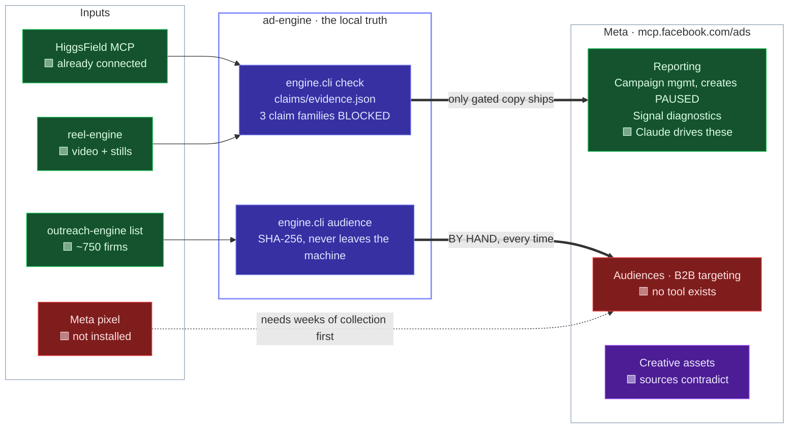
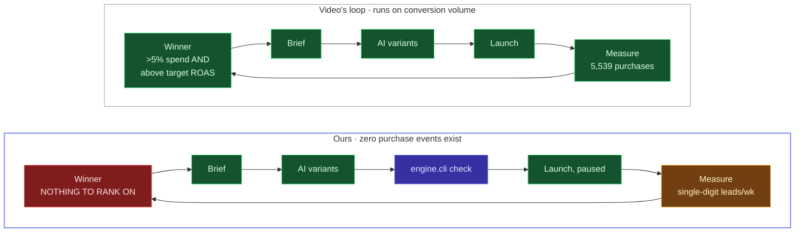
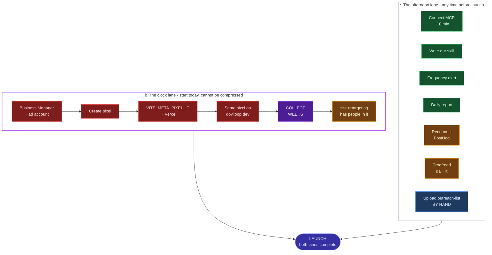

# Meta MCP — the map

> Companion to `META-MCP-SETUP.md`, which carries the reasoning and the sources.
> This file is the picture. Renders on GitHub and in Obsidian.
> All three diagrams were rendered and checked, not just written.
>
> 🟩 works today · 🟦 works, but manual forever · 🟨 blocked on something of ours
> · 🟥 does not exist · 🟪 contradictory, untested

---

## 1. Everything crosses one gate

**The two thick edges are the whole story.**

- Every asset Claude generates crosses `engine.cli check` before it reaches Meta.
  No off-the-shelf media-buyer skill has this, and every one of them is tuned to
  write exactly the percentage `claims/evidence.json` exists to block.
- `outreach-list` — priority 1, the only audience that matches the ICP — crosses
  into Meta **by hand**, forever. The connector has no audience tool. The single
  most important object in this repo is outside the agent's reach.

---

## 2. The flywheel — theirs vs. ours

Two differences, and they are the entire adaptation:

- **The loop does not close.** Their `Measure → Winner` edge carries thousands of
  purchases. Ours carries a handful of leads a week — below any statistical test.
  Read it as a log, not a signal. Winners get picked by judgement here.
- **A gate sits in the middle of ours** that has no counterpart in theirs.

**What replaces their detectors:**

| Video builds | Needs | Our substitute |
|---|---|---|
| Winner detection (ROAS + 5% spend) | purchases | qualified leads from PostHog — judgement, not a threshold |
| Anomaly detection at 2 SD | daily conversions | 2 SD on **delivery**: spend · CPM · reach · frequency |
| Creative flywheel, ~100/wk | budget + volume | reel-engine reuse first, 2 arms only, gate every variant |
| Scheduled daily report | nothing | ✅ ports unchanged — cheapest win on the board |

> **⚠️ Frequency is the metric that will bite.** ~750 firms × 2–3 contacts ≈ 2,000
> people. Meta wants ~50 conversions per ad set per week to leave the learning
> phase; we will never supply that, so it never optimises — it just spends. Reach
> saturates in days and frequency climbs hard. **Build that alert first.** The
> videos treat frequency as a secondary metric. On this audience it is the
> primary one.

---

## 3. Critical path — the pixel is a clock

**The bottom lane is an afternoon. The top lane is a calendar.**

The pixel does nothing on the day you install it — it has to *have been* running.
`audiences/site-retargeting.json` says exactly that in its own `blocked_on`
field. It is the only item here where delay costs weeks instead of hours, and
it is currently at step zero.

---

## 4. Status ledger

| Thing | State | Where it lives |
|---|---|---|
| Meta ad account | 🟥 no `act_` ID in any of the three repos | — |
| Meta connector | 🟩 available, open beta | `mcp.facebook.com/ads` |
| Audience upload | 🟦 manual forever — no MCP tool | `engine/audience.py` |
| B2B targeting | 🟥 does not exist on any Meta surface | — |
| Creative asset reads | 🟪 sources contradict, untested | §2, setup doc |
| Claims gate | 🟩 working | `engine.cli check` |
| HiggsField | 🟩 connected on this account | verified 2026-09-16 |
| reel-engine assets | 🟩 referenced by creative specs | `creative/capacity.json` |
| Meta pixel | 🟥 `VITE_META_PIXEL_ID` empty | `campaign-site/.env.example` §5 |
| Pixel on doviloop.dev | 🟥 not installed | `audiences/site-retargeting.json` |
| PostHog | 🟨 `needs_reconnect` | connector settings |
| da / lt ad copy | 🟨 `NEEDS_NATIVE_PROOFREAD` | `creative/*.json` |
| Varnan-Tech skill | 🟥 wrong MCP, stale, stubbed | §5, setup doc |
| Our own skill | 🟨 not written | offered, not started |
